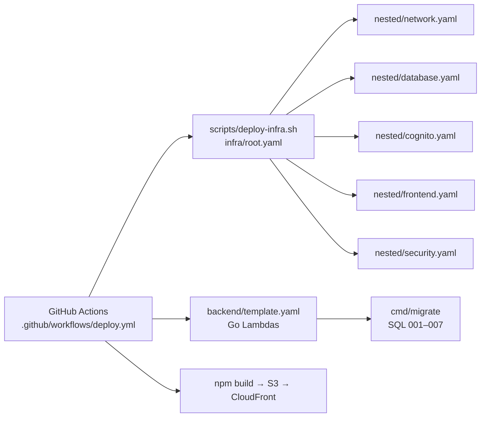
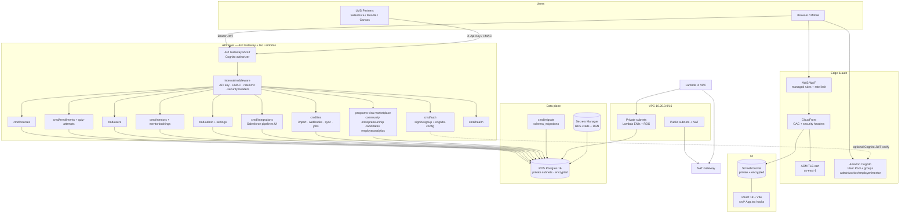

# SuperlativeBridge — AWS architecture

Complete production topology deployed by GitHub Actions from this repository.
Every major code package and infra template is mapped below.

## Deploy path (one pipeline)

## Runtime architecture

## Code → AWS mapping

| Repo path | AWS / role |
| --- | --- |
| `infra/root.yaml` + `infra/nested/*` | VPC, RDS, Cognito, S3, CloudFront, ACM, WAF, Secrets |
| `backend/template.yaml` | SAM: API Gateway + all Go Lambdas |
| `backend/cmd/<svc>/main.go` | One Lambda per domain (courses, auth, lms, …) |
| `backend/cmd/localserver` | Local Docker HTTP server (same handlers) |
| `backend/cmd/migrate` | One-shot migration Lambda in VPC |
| `backend/internal/handlers/*` | Business logic |
| `backend/internal/middleware` | LMS API key, webhook HMAC, rate limit, headers |
| `backend/internal/auth` | Local HS256 JWT + Cognito RS256 JWKS |
| `backend/migrations/001–007` | Postgres schema, seed, audit, sample courses, integrations, LMS |
| `src/*` | UI on S3/CloudFront |
| `.github/workflows/deploy.yml` | Full deploy pipeline |
| `scripts/deploy-infra.sh` | Package nested CFN → deploy root |
| `docs/architecture.md` | This document |

## Security controls

- **Network:** RDS not public; Lambdas in private subnets; egress via NAT.
- **Secrets:** Master password + DSN in Secrets Manager; never in git.
- **Auth:** Cognito User Pool (password policy, optional MFA, groups). API Gateway Cognito authorizer when pool ARN provided. Handlers also accept Cognito JWT (JWKS) or local JWT for dual-run.
- **Edge:** CloudFront HTTPS-only, OAC to S3 (no public bucket), AWS managed security response headers, WAF common/bad-input rules + IP rate limit.
- **LMS ingest:** `X-Api-Key` for course import; HMAC `X-SB-Signature` + timestamp window for webhooks; per-key rate limit.
- **Data:** Postgres storage encryption, 7-day backups, audit triggers (`005`), soft-delete columns.
- **CI:** OIDC deploy role preferred (`AWS_DEPLOY_ROLE_ARN`); least-privilege stack deploys.

## LMS integration API

| Method | Path | Auth | Purpose |
| --- | --- | --- | --- |
| GET | `/api/lms/providers` | public | List Moodle/Canvas/Salesforce/Workday connectors |
| POST | `/api/lms/courses/import` | API key | Upsert courses/modules from 3rd-party LMS |
| POST | `/api/lms/webhooks/{provider}` | HMAC | Salesforce (and others) event ingest |
| POST | `/api/lms/providers/{provider}/sync` | admin JWT | Trigger sync job (orchestrates with `/api/integrations` pipelines) |
| GET | `/api/lms/jobs` | admin JWT | Recent import/sync/webhook jobs |

Salesforce contact/cert pipelines remain under `/api/integrations` (Airflow-style DAGs). LMS layer writes courses into the same `courses`/`modules` tables and links them via `lms_external_courses`.

## Required GitHub configuration

**Secrets:** `AWS_DEPLOY_ROLE_ARN` (or access key pair), `JWT_SECRET`, `LMS_API_KEY`, `INTEGRATION_WEBHOOK_SECRET`, optional `CFN_ARTIFACT_BUCKET`, optional `DATABASE_URL` fallback.

**Variables:** `AWS_REGION`, `ENVIRONMENT`, optional `DOMAIN_NAME`, `HOSTED_ZONE_ID`, `CERTIFICATE_ARN`.

## Local vs AWS

| Concern | Local (`docker compose`) | AWS |
| --- | --- | --- |
| API | `cmd/localserver` :8081 | Lambda + API Gateway |
| DB | Postgres container | RDS Postgres 16 |
| Auth | JWT_SECRET | Cognito (+ JWT fallback) |
| UI | Vite :8080 | S3 + CloudFront + ACM |
